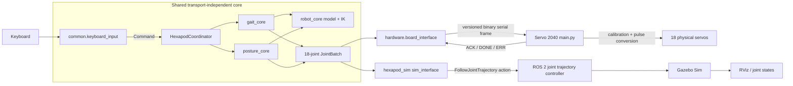
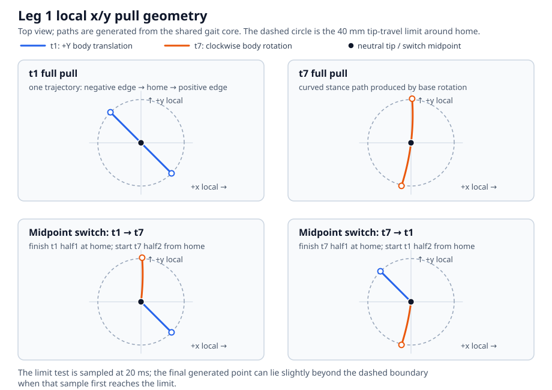
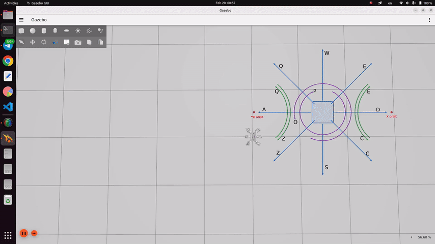

# Hexapod gait controller

This repository runs the same transport-independent robot model, gait
generator, posture generator, keyboard mapping, and mode coordinator against a
physical Servo 2040 hexapod or a ROS 2 simulation. Only the final I/O adapter
and actuator backend differ. A ready-to-run Docker environment builds and
launches the Gazebo/RViz simulation with the interactive keyboard interface.

## Layout

```text
hexapod_gait/
├── common/
│   └── keyboard_input.py              shared nonblocking keyboard mapping
├── gait_core/
│   └── lite_gait.py                   tripod paths, swings, templates, gait state
├── posture_core/
│   └── posture.py                     elevation, pitch, roll, limits, smoothing
├── robot_core/
│   ├── control.py                     commands and normal/auto/posture modes
│   ├── coordinator.py                 shared motion arbitration
│   ├── model.py                       geometry, frames, fixed-foot transforms, IK
│   └── motion_batch.py                transport-neutral JointBatch and goal IDs
├── hardware/                          physical-robot-only code
│   ├── board_interface.py             host keyboard and binary serial adapter
│   ├── main.py                        Servo 2040 validation, calibration, playback
│   ├── protocol.py                    shared host/MicroPython wire protocol
│   └── calibration.txt                readable copy of calibration constants
├── ros2_ws/
│   └── src/
│       └── hexapod_sim/               simulation-only ROS 2 package
│           ├── config/
│           │   └── robot_controller.yaml
│           │                                  ros2_control joint trajectory setup
│           ├── launch/
│           │   └── robot.launch.py             Gazebo/RViz launch and arguments
│           ├── meshes/                         base, coxa, femur, tibia DAE meshes
│           ├── rviz/
│           │   └── config.rviz                 default RViz display configuration
│           ├── scripts/
│           │   ├── sim_interface.py            shared-core ROS action adapter
│           │   ├── base_pose_manipulator.py    legacy direct pose utility
│           │   └── elevation_pitch_keyboard.py legacy posture utility
│           └── urdf/
│               ├── hexapod.urdf.xacro          robot, mounts, Gazebo integration
│               └── xacro_include/
│                   ├── joint_control_macro.xacro
│                   └── leg_macro.xacro         reusable leg/control definitions
├── docs/
│   ├── controls.gif                     simulation keyboard-control demonstration
│   └── gait_path_example.svg           generated-geometry documentation diagram
├── tests/                               core, protocol, and calibration regression tests
├── requirements.txt                    host Python dependency (`pyserial`)
└── README.md
```

The original repositories remain untouched. Their histories are preserved as
`hardware-history` and `simulation-history`; `main` contains both histories as
ancestors plus the shared implementation.

## Architecture

### Communication



Both adapters instantiate the same `HexapodCoordinator` and receive the same
joint values, phase boundaries, sample period, and goal IDs. There is no ROS
command topic: both adapters read the terminal directly.

| Concern | Hardware | Simulation |
| --- | --- | --- |
| Batch transport | Binary USB serial | `FollowJointTrajectory` action |
| Joint point representation | 18 float32 radians | 18 ROS position values in radians |
| Point timing | Discrete board-clock application; no interpolation | Controller may interpolate between timed points |
| Hardware conversion | Robot radians → calibrated servo degrees → pulses | Not used |
| Completion | Text `ACK` then `DONE`/`ERR` | ROS action result |

### High-level motion logic

1. Keyboard input becomes a transport-neutral command. Input is latched rather
   than queued; after terminal draining, only the latest command remains.
2. The top-level coordinator enforces standup readiness, owns the active mode,
   and gives either gait or posture exclusive control of joint output.
3. The gait core generates motion profiles for a tripod gait by transforming
   body-frame displacement into the local tip displacement that keeps each
   stance foot fixed in the world.
4. Pull paths advance the base model in 20 ms increments until any selected
   tripod tip reaches the 40 mm travel radius. A full path has a negative half,
   the neutral midpoint, and a positive half.
5. Swing paths trace the reversed pull path in x/y. Their z coordinate adds a
   sinusoid, `swing_height × sin(πs)`, producing a ground-to-ground arc for
   start/stop halves or a continuous arc across a full step.
6. Cartesian construction paths are temporary. After IK conversion, only
   synchronized, future-setpoint joint templates are retained. The already
   confirmed point at a phase boundary is not stored or transmitted again.
7. The six leg sequences in a phase must have identical lengths. Every ideal
   joint sample is retained; the shared core performs no mechanical-resolution
   thresholding.
8. Direction changes are applied at the full-step midpoint. Commands received
   during the first half are latched, and the second-half pull/swing templates
   can use the new trajectory type.
9. Each half-step-sized `JointBatch` is handed to the selected adapter. A new
   batch is not issued until the current one reports completion.

The following top view uses actual leg-1 Cartesian points generated by the
core. It compares `t1` (`+Y` body translation), `t7` (clockwise body rotation),
and the two hybrid full pulls produced when the direction changes at home.



The dashed circle is centered on the neutral tip. Because limit detection is
sampled, the final generated point may lie slightly beyond the 40 mm circle on
the first sample that reaches the limit.

### Modes and state behavior

- `normal` accepts bare movement keys as continuous commands. A new movement
  direction is latched and applied at the next full-step midpoint.
- `auto` only accepts a movement command with an integer step count of at least
  two. A count of `N` executes `starting half-step + (N - 1) full steps + final
  half-step`. The two boundary halves contribute one combined step. Auto jobs
  start and end stationary, ignore other movement commands, and are aborted by
  `0` through the normal final-half path.
- `posture` starts from canonical stationary and accepts an objective elevation
  target or relative pitch and roll changes. Elevation can coexist with either
  tilt. Pitch and roll cannot coexist; reset the active tilt before selecting
  the other axis.
  Completed non-neutral commands enter `POSTURE_HOLD`, so another posture
  command can continue from the confirmed pose. Elevation is always expressed
  as the objective body height above the stance-tip plane.
- Toggling modes while moving first requests a stationary transition. Leaving
  posture removes pitch or roll, returns to the stationary objective elevation,
  and only then activates normal or auto mode.
- Standup is explicit. `u` commands the standup pose and descent; `k` sends no
  movement and asserts that the robot is already at the canonical standing
  pose. From a stationary pose, `j` reverses the standup tip motion and ends at
  the pose into which standup initially snaps. Completion restores the standup
  readiness lock; standup (or the explicit skip assertion) is then required
  before other commands are accepted. A sitdown/standup cycle preserves the
  current normal, auto, or posture mode.

There is no emergency-stop protocol. `0` is a coordinated stop, and a serial
or ROS batch already executing runs to its next supported boundary.

## Usage

Run commands from the repository root unless a command changes directory.

### Hardware

Install the host dependency and `mpremote` if it is not already available:

```bash
python3 -m pip install -r requirements.txt
python3 -m pip install mpremote
```

Copy both MicroPython files to the Servo 2040. `main.py` imports `protocol.py`
from the board filesystem:

```bash
mpremote connect /dev/ttyACM0 cp hardware/protocol.py :protocol.py
mpremote connect /dev/ttyACM0 cp hardware/main.py :main.py
```

Run the host adapter:

```bash
python3 -m hardware.board_interface --port /dev/ttyACM0
```

Hardware adapter arguments:

| Argument | Default | Meaning |
| --- | ---: | --- |
| `--port` | `/dev/ttyACM0` | Servo 2040 serial device |
| `--baudrate` | `115200` | PySerial baud setting |
| `--response-timeout` | `8.0` s | ACK/DONE timeout; includes the firmware's five-second boot delay |

Wait for the board's `READY 1` response before diagnosing an initial timeout.
The firmware accepts one batch at a time, validates its version, IDs, shape,
sample period, finite values, payload size, and CRC, and then applies points at
absolute board-clock deadlines.

### ROS 2 simulation and RViz

Build the package in a ROS 2 Humble environment:

```bash
cd ros2_ws
source /opt/ros/humble/setup.bash
colcon build --symlink-install
source install/setup.bash
```

Launch Gazebo Sim with RViz in the first terminal:

```bash
ros2 launch hexapod_sim robot.launch.py sim:=true rviz:=true use_sim_time:=true
```

In a second sourced terminal, run the shared keyboard controller:

```bash
cd ros2_ws
source /opt/ros/humble/setup.bash
source install/setup.bash
ros2 run hexapod_sim sim_interface.py
```

The simulation adapter parameters can be overridden through ROS arguments:

```bash
ros2 run hexapod_sim sim_interface.py --ros-args \
  -p action_name:=/joint_trajectory_controller/follow_joint_trajectory \
  -p wait_timeout:=10.0
```

`robot.launch.py` arguments:

| Argument | Default | Effect |
| --- | ---: | --- |
| `sim` | `true` | Starts Gazebo Sim, spawns the robot, bridge, and ros2_control controllers |
| `rviz` | `false` | Starts RViz with `rviz/config.rviz` |
| `use_sim_time` | `true` | Selects the Gazebo `/clock` for ROS nodes |

Use `ros2 launch hexapod_sim robot.launch.py --show-args` to list these and
the version-dependent arguments forwarded by the included Gazebo launch file.

Common launch variants:

```bash
# Gazebo Sim only (all defaults)
ros2 launch hexapod_sim robot.launch.py

# Gazebo Sim and RViz
ros2 launch hexapod_sim robot.launch.py rviz:=true

# RViz-only model inspection; no trajectory action server is created
ros2 launch hexapod_sim robot.launch.py sim:=false rviz:=true use_sim_time:=false
```

Do not run `sim_interface.py` with the RViz-only variant unless another node
provides the configured trajectory action server.

### Docker simulation

The Docker image uses `osrf/ros:humble-desktop-full`, copies the local checkout,
installs the dependencies declared by `hexapod_sim`, and builds the ROS
workspace. From the repository root, build and run Gazebo, RViz, and the
interactive keyboard interface with:

```bash
./run_sim_docker.sh
```

The script forwards the host X11 display, host networking, the terminal, and
`/dev/dri` when it is available. It rebuilds the image using Docker's layer
cache before each run. The resulting desktop image is approximately 4 GB. To
reuse an existing image or omit RViz:

```bash
./run_sim_docker.sh --no-build
./run_sim_docker.sh --no-rviz
```

Run `./run_sim_docker.sh --help` for image-name and environment overrides.
Closing the keyboard interface also stops the launch process and removes the
container. The host must provide Docker, `xhost`, an X11-compatible `DISPLAY`,
and access to the Docker daemon.

### Keyboard controls

The controls are identical for hardware and simulation.

| Key | Command |
| --- | --- |
| `u` | Explicit standup sequence |
| `k` | Skip standup and assert that the robot is already standing |
| `j` | Sit down from stationary and restore the standup lock |
| `0` | Graceful gait stop; in posture, interrupt and then return neutral |
| `t` | Cycle normal → auto → posture → normal |
| `w`, `d`, `s`, `a` | Move `+Y`, `+X`, `-Y`, `-X` |
| `q`, `e`, `z`, `c` | Diagonal motion, or orbit motion after pressing `m` |
| `m` | Toggle the `q/e/z/c` mapping between diagonal and orbit |
| `o`, `p` | Rotate counterclockwise / clockwise |
| `5w` | Example auto command: move `+Y` for five counted steps |
| `100]` | Move to an objective elevation of 100 mm in posture mode |
| `5.`, `5,` | Add / subtract 5° pitch in posture mode |
| `5'`, `5;` | Add / subtract 5° roll in posture mode |
| `r` | Reset pitch or roll to zero while preserving elevation |
| Backspace | Delete the last numeric-prefix digit |
| Escape | Clear the numeric prefix |
| `x` | Quit after the current batch |



Posture commands require a numeric prefix and are not queued. `]` interprets
that number as an objective elevation in millimetres; pitch and roll numbers
remain relative degree changes from the confirmed pose. During an active
posture command, the first `0` discards remaining points after the current
25-point boundary and enters `POSTURE_HOLD`; a second `0` from that hold
returns to the stationary objective elevation and zero tilt. `r` uses the same
smoothed, non-queued motion to zero the active tilt without changing elevation.

## Hardcoded parameters

Unless stated otherwise, lengths are metres internally and angles are radians.

### Coordinate and joint conventions

These are the shared motion-model and keyboard-command conventions. The URDF
uses mount rotations to adapt its links to the same joint values; no Cartesian
base command is sent through either output adapter.

- Body `+Y` is forward, body `+X` is right, and body `+Z` is up.
- Roll, pitch, and yaw rotate about body `+X`, `+Y`, and `+Z` respectively.
  Positive rotations follow the right-hand rule; equivalently, joint-positive
  rotation is counterclockwise in its defined local plane.
- Every leg has a local frame whose `+X` points radially outward from its body
  mount, `+Y` is tangential, and `+Z` matches body up.
- Joint `j1` is coxa/base rotation, `j2` is femur/hip rotation, and `j3` is
  tibia/knee rotation. IK zero `(0, 0, 0)` means the complete leg is straight
  and fully extended along local `+X`.
- Shared and hardware names are `j<leg><joint>`; ROS names insert `l`, for
  example hardware `j12` corresponds to ROS `jl12`.
- Shared 18-value batches are leg-major:
  `j11,j12,j13,j21,j22,j23,...,j61,j62,j63`.

Leg frames and tripod membership:

| Leg | Body mount x | Body mount y | Local heading | Tripod | Location |
| ---: | ---: | ---: | ---: | :---: | --- |
| 1 | -53.5 mm | +90.0 mm | +135° | A | front-left |
| 2 | -70.0 mm | 0.0 mm | +180° | B | middle-left |
| 3 | -53.5 mm | -90.0 mm | -135° | A | rear-left |
| 4 | +53.5 mm | +90.0 mm | +45° | B | front-right |
| 5 | +70.0 mm | 0.0 mm | 0° | A | middle-right |
| 6 | +53.5 mm | -90.0 mm | -45° | B | rear-right |

### Shared kinematic model

| Parameter | Value |
| --- | ---: |
| Coxa length `l1` | 38.5 mm |
| Femur length `l2` | 70.0 mm |
| Tibia length `l3` | 102.0 mm |
| Neutral local tip | `(x, y, z) = (110, 0, -50)` mm |
| Stationary objective elevation `-home_z` | 50 mm |
| Neutral IK angles per leg | approximately `(0°, -45.096°, +122.591°)` |
| Femur/tibia planar reach after coxa | 32–172 mm |

The IK first solves coxa rotation from local tip x/y, subtracts the coxa
length, and then solves the femur/tibia triangle. Gait templates stay inside
the configured tip radius. Posture targets are checked as complete six-leg
body poses; a target outside the operating envelope or IK workspace is reduced
along its motion path rather than clamping legs independently.

### Gait configuration

| Parameter | Value |
| --- | ---: |
| Sample period / rate | 20 ms / 50 Hz |
| Tip travel limit radius | 40 mm |
| Swing height | 25 mm |
| `+X`, `+Y`, diagonal component speed | 0.10 m/s |
| Self-rotation angular speed | 0.40 rad/s |
| Orbit angular speed | 0.30 rad/s |
| External orbit radius | 0.30 m |
| Standup local tip z | +10 mm |
| Standup descent speed | 0.05 m/s |
| Standup pose hold | 2.0 s |
| Standup descent | 60 points / 1.2 s |
| Sit-down reverse motion | 60 points / 1.2 s |

Reverse trajectory IDs 8–14 evaluate IDs 1–7 at negative time. Current
future-setpoint counts per half-step phase are:

| Motion | Trajectory IDs | Points per phase |
| --- | --- | ---: |
| Straight x/y | 1, 2, 8, 9 | 20 |
| Diagonal | 3, 4, 10, 11 | 15 |
| Orbit | 5, 6, 12, 13 | 14 or 15 depending on pulling tripod |
| Self-rotation | 7, 14 | 24 |

### Posture configuration

Posture trajectories use a 20 ms cubic smoothstep profile.

| Parameter | Value |
| --- | ---: |
| Elevation maximum velocity | 30 mm/s |
| Elevation maximum acceleration | 50 mm/s² |
| Pitch/roll maximum velocity | 10°/s |
| Pitch/roll maximum acceleration | 40°/s² |
| Maximum batch | 25 points / 0.5 s |
| Operating angular-limit scale | 0.9 |
| Minimum objective elevation | 25 mm |
| Stationary objective elevation `-home_z` | 50 mm |
| Maximum objective elevation | 150 mm |
| IK boundary-search iterations | 52 |
| Neutral tolerance | `1e-9` |

Objective elevation is derived directly from the kinematic model. The
stationary value is `-home_z`; changing `home_z` therefore changes the
stationary posture target automatically without moving or reinterpreting the
fixed 25–150 mm operating envelope. Internally, the fixed-foot transform uses
the difference between the commanded objective elevation and `-home_z`.

The measured angular envelope is linearly interpolated between objective
elevation knots. The scaled values are the limits actually applied by the
coordinator.

| Objective elevation | Raw roll | Applied roll | Raw pitch | Applied pitch |
| ---: | ---: | ---: | ---: | ---: |
| 25 mm | 0° | 0° | 0° | 0° |
| 50 mm | 12° | 10.8° | 12° | 10.8° |
| 100 mm | 20° | 18° | 25° | 22.5° |
| 130 mm | 10° | 9° | 12° | 10.8° |
| 150 mm | 0° | 0° | 0° | 0° |

### Hardware protocol and playback

| Parameter | Value |
| --- | ---: |
| Protocol magic / version / type | `HXGB` / 1 / batch type 1 |
| Joint values per point | 18 float32 radians / 72 bytes |
| Fixed frame overhead | 28-byte header + 4-byte CRC |
| Frame size | `32 + 72 × point_count` bytes |
| Maximum points per frame | 64 |
| Accepted sample-period range | 1–1000 ms |
| Default serial configuration | `/dev/ttyACM0`, 115200 baud |
| Firmware boot wait | 5 s |

The header contains magic, protocol version, message type, header size,
session ID, unique goal ID, joint count, point count, sample period, and payload
length. The board rejects malformed, stale, non-finite, or CRC-invalid goals.
Retries reuse the same session/goal ID and are idempotent.

### Servo 2040 channel order and calibration

The incoming vector is leg-major, but physical channels are joint-major:

| Board channels | Joints in channel order |
| --- | --- |
| 1–6 | `j11, j21, j31, j41, j51, j61` |
| 7–12 | `j12, j22, j32, j42, j52, j62` |
| 13–18 | `j13, j23, j33, j43, j53, j63` |

For each joint:

```text
servo_deg = s × robot_deg + b
pulse_us   = 1500 + k × servo_deg
```

`k+` is used for non-negative servo degrees and `k-` for negative servo
degrees. Pulses are clamped to 500–2500 µs. These are the runtime values in
`hardware/main.py`:

| Joint | `s` | `b` (deg) | `k+` (µs/deg) | `k-` (µs/deg) |
| --- | ---: | ---: | ---: | ---: |
| `j11` | +1 | 0 | 10.6667 | 10.8889 |
| `j12` | -1 | -84 | 11.1556 | 10.8889 |
| `j13` | +1 | -121 | 10.4444 | 11.3333 |
| `j21` | +1 | 0 | 10.3333 | 11.3333 |
| `j22` | -1 | -69 | 10.5556 | 12.0000 |
| `j23` | +1 | -114 | 11.1667 | 11.1667 |
| `j31` | +1 | 0 | 11.1111 | 10.6667 |
| `j32` | -1 | -79 | 11.1111 | 10.8889 |
| `j33` | +1 | -121 | 11.0000 | 10.6667 |
| `j41` | +1 | 0 | 10.5556 | 10.8889 |
| `j42` | -1 | -74 | 11.1111 | 11.0000 |
| `j43` | +1 | -118 | 10.7778 | 11.1111 |
| `j51` | +1 | 0 | 12.0000 | 11.1111 |
| `j52` | -1 | -67 | 10.6667 | 11.1111 |
| `j53` | +1 | -112 | 10.6667 | 10.8889 |
| `j61` | +1 | 0 | 10.8889 | 11.1111 |
| `j62` | -1 | -78 | 11.5556 | 10.4444 |
| `j63` | +1 | -121 | 11.0000 | 10.5556 |

### Simulation-only parameters

| Parameter | Value |
| --- | ---: |
| Gazebo spawn pose | `(x, y, z) = (0, 0, 0.25)` m |
| ros2_control update rate | 100 Hz |
| URDF revolute limits | `[-π, +π]` rad |
| URDF joint velocity limit | `2π` rad/s |
| URDF joint effort limit | 1000 |
| ros2_control initial `j1/j2/j3` | `0, -0.955, 2.216` rad |
| Tip friction `mu1`, `mu2` | 1.2, 1.2 |
| Tip contact `kp`, `kd` | `1e6`, 100 |
| Tip contact `minDepth`, `maxVel` | 0.001 m, 0.1 m/s |

The controller uses position commands and position/velocity state interfaces.
The YAML contains a commented `interpolation_method: none`, so the installed
controller's default interpolation behavior is currently used. The shared
neutral IK pose is approximately `(0, -0.787, 2.140)` rad per leg; the first
coordinator motion establishes that shared pose from the URDF controller's
initial values.

## Tests

Run the complete host-side suite from the repository root:

```bash
python3 -m unittest discover -s tests -v
```

Run a focused suite when changing one subsystem:

```bash
python3 -m unittest tests.test_gait_core -v
python3 -m unittest tests.test_posture_core -v
python3 -m unittest tests.test_protocol tests.test_calibration -v
```

Verify that the ROS package still installs the shared modules and scripts:

```bash
cd ros2_ws
source /opt/ros/humble/setup.bash
colcon build --symlink-install --packages-select hexapod_sim
```

The tests cover standup/sitdown readiness locking, exact executable template
sizes, equal leg sequence lengths, future-only boundary points, sub-degree
sample propagation, normal/auto/posture transitions, counted and aborted gait
jobs, midpoint direction latching, objective elevation targeting, pitch/roll
exclusion, smoothed profile limits, posture interruption boundaries,
IK/envelope clamping, protocol validation and idempotence, finite joint values,
and calibrated pulse regression.
