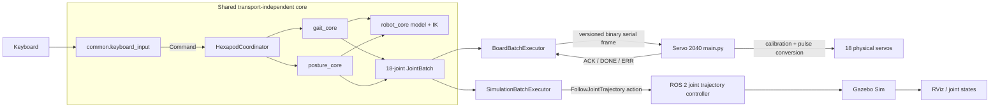
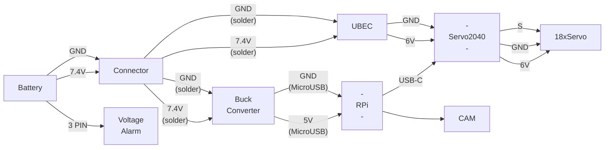
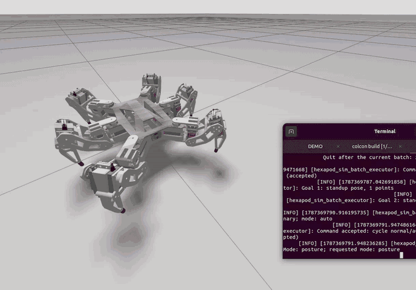
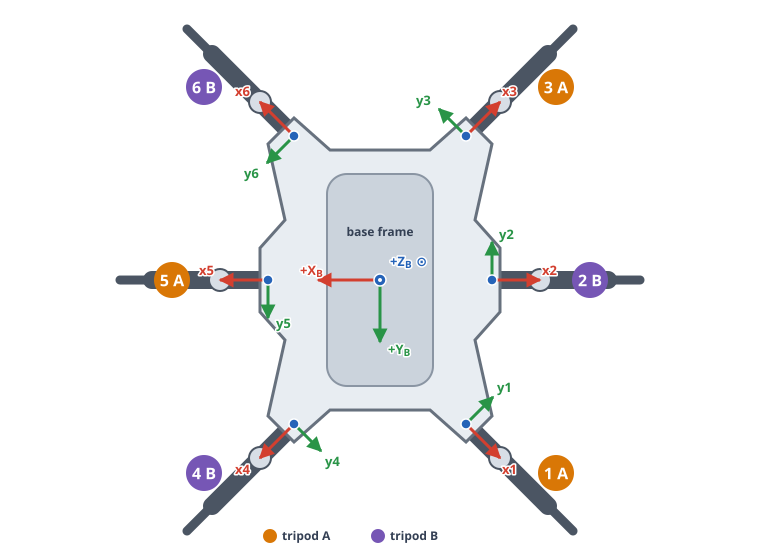

# ROSBug Hexapod

ROSBug is an open-source, Raspberry Pi-based hexapod robot with an onboard
camera. This repository provides its CAD and printable models, physical-robot
hardware code, and a ROS 2 simulation package. The physical robot and
simulation depend on the same transport-independent model, gait generator,
posture generator, keyboard mapping, and mode coordinator; only their final
I/O adapters and actuator backends differ. A ready-to-run Docker environment
builds and launches the Gazebo/RViz simulation with the interactive keyboard
interface.

## Repository Layout

```text
ROSBug-Hexapod/
├── cad/
│   └── stl/                          printable mechanical parts
│       ├── base_.STL
│       ├── bearing_holder+bearing_holder_2.STL
│       ├── bearing_link.STL
│       ├── cam_mount+cam_shield.STL
│       ├── cover_2.STL
│       ├── coxa_1.STL
│       ├── coxa_2.STL
│       ├── femur_1.STL
│       ├── femur_2.STL
│       ├── spacer.STL
│       ├── tibia_1_.STL
│       └── tibia_2_.STL
├── common/
│   └── keyboard_input.py              shared nonblocking keyboard mapping
├── gait_core/
│   └── lite_gait.py                   tripod paths, swings, templates, gait state
├── posture_core/
│   └── posture.py                     elevation, pitch, roll, limits, smoothing
├── robot_core/
│   ├── control.py                     commands and normal/auto/posture modes
│   ├── coordinator.py                 shared motion arbitration
│   ├── execution.py                   shared batch-executor result contract
│   ├── feedback.py                    structured command/state feedback
│   ├── model.py                       geometry, frames, fixed-foot transforms, IK
│   └── motion_batch.py                transport-neutral JointBatch and goal IDs
├── hardware/                          physical-robot-only code
│   ├── firmware/
│   │   ├── pico-v1.27.0-pimoroni-micropython.uf2
│   │   │                                  bundled Servo 2040 MicroPython runtime
│   │   └── servo2040_hard_reset.txt      BOOTSEL recovery and flashing procedure
│   ├── batch_executor.py              reusable binary serial batch executor
│   ├── board_interface.py             host keyboard frontend
│   ├── main.py                        Servo 2040 validation, calibration, playback
│   ├── protocol.py                    shared host/MicroPython wire protocol
│   └── calibration.txt                readable copy of calibration constants
├── ros2_ws/
│   └── src/
│       └── hexapod_sim/               simulation-only ROS 2 package
│           ├── config/
│           │   └── robot_controller.yaml
│           │                                  ros2_control joint trajectory setup
│           ├── launch/
│           │   └── robot.launch.py             Gazebo/RViz launch and arguments
│           ├── meshes/                         base, coxa, femur, tibia DAE meshes
│           ├── rviz/
│           │   └── config.rviz                 default RViz display configuration
│           ├── scripts/
│           │   ├── sim_interface.py            host keyboard frontend
│           │   └── simulation_batch_executor.py reusable ROS action executor
│           └── urdf/
│               ├── hexapod.urdf.xacro          robot, mounts, Gazebo integration
│               └── xacro_include/
│                   ├── joint_control_macro.xacro
│                   └── leg_macro.xacro         reusable leg/control definitions
├── docs/
│   ├── controls.gif                     simulation keyboard-control demonstration
│   ├── full_cad.png                     complete mechanical CAD rendering
│   ├── gait_path_example.svg           generated-geometry documentation diagram
│   ├── leg_frames.svg                  leg-frame and tripod-membership diagram
│   └── posture.gif                     simulation posture-control demonstration
├── requirements.txt                    host Python dependency (`pyserial`)
└── README.md
```

## Architecture

### Communication



| Concern | Hardware | Simulation |
| --- | --- | --- |
| Batch transport | Binary USB serial | `FollowJointTrajectory` action |
| Joint point representation | 18 float32 radians | 18 ROS position values in radians |
| Point timing | Discrete board-clock application; no interpolation | Controller may interpolate between timed points |
| Hardware conversion | Robot radians → calibrated servo degrees → pulses | Not used |
| Completion | Text `ACK` then `DONE`/`ERR` | ROS action result |

### High-level motion logic

1. Keyboard input becomes a transport-neutral command. Input is not
   queued and after terminal draining, only the latest command remains.
2. The top-level coordinator refuses commands before the robot is standing up readiness
   and gives either gait or posture exclusive control of joint output.
3. The gait core generates motion profiles for a tripod gait by transforming
   body-frame displacement into the local tip displacement that keeps each
   stance foot fixed in the world.
4. Pull (stance) paths advance the base model in 20 ms increments until any selected
   tripod tip reaches the 40 mm travel radius. A full path has two halfs and
   a neutral midpoint.
5. Swing paths trace the reversed pull path in x/y. Their z coordinate adds a
   sinusoid, `swing_height × sin(πs)`, producing a ground-to-ground arc for
   start/stop halves or a continuous arc across a full step.
6. After IK conversion, synchronized, future-setpoint joint templates are retained.
7. The six leg sequences in a phase must have identical lengths.
8. A half step is needed at the start/end of a walk to exit/return to the neutral position
9. Direction changes are applied at the full-step midpoint where two trajectory type halves are joined.
10. Each half-step-sized `JointBatch` is handed to the selected adapter. A new
   batch is not issued until the current one reports completion.
11. Posture mode movements (elevation/tilt/roll) all happen while the robot
   tips are in the neutral position.

The following top view uses actual leg-1 Cartesian points generated by the
core. It compares `t1` (`+Y` body translation), `t7` (clockwise body rotation),
and the two hybrid full pulls produced when the direction changes at home.


The dashed circle is centered on the neutral tip. Because limit detection is
sampled, the final generated point may lie slightly beyond the 40 mm circle on
the first sample that reaches the limit.

### Modes and state behavior

- At startup, the coordinator rejects counted motion until
  standup `u` command or the skip assertion completes.
- `normal` accepts bare movement keys as continuous commands. A new movement
  direction is latched and applied at the next full-step midpoint.
- `auto` only accepts a movement command with an integer step count of at least
  two. Auto jobs start and end stationary, and are aborted by `0`.
- `posture` starts from canonical stationary and accepts relative elevation,
  pitch, and roll changes. Elevation can coexist with either
  tilt. Pitch and roll cannot coexist; reset the active tilt before selecting
  the other axis.

## CAD

The editable mechanical model is available in the
[ROSBug Hexapod Onshape document](https://cad.onshape.com/documents/2a9acbb79b23a0da46d8b498/w/10c7141c859961b97a14543a/e/498922900873c82099a5cf37).
Print-ready meshes are included in [`cad/stl`](cad/stl).


## Electronics



### Bill of materials

Amazon links open a live Amazon UK search for the required specification,
reference prices were checked on 21 August 2026 and include the quantity.

#### Electronics and mechanical parts

| Item | Qty. | Source | Reference price |
| --- | ---: | --- | ---: |
| Raspberry Pi 3 Model B+ | 1 | [Amazon UK](https://www.amazon.co.uk/s?k=Raspberry+Pi+3+Model+B%2B) | £43.40 |
| 32 GB microSDHC card | 1 | [Amazon UK](https://www.amazon.co.uk/s?k=32GB+microSDHC+card+Class+10) | £8.99 |
| MG996R metal-gear servo | 18 | [Amazon UK](https://www.amazon.co.uk/s?k=MG996R+servo+6+pack) | £89.97 |
| Raspberry Pi Camera Module v2.1 | 1 | [Amazon UK](https://www.amazon.co.uk/s?k=Raspberry+Pi+Camera+Module+v2.1) | £8.70 |
| XL4015 adjustable DC-DC buck converter | 1 | [Amazon UK](https://www.amazon.co.uk/s?k=XL4015+5A+buck+converter) | £6.38 |
| Servo 2040 controller | 1 | [Pimoroni](https://shop.pimoroni.com/products/servo-2040) | £24.00 |
| 6200 mAh 7.4 V 60C LiPo battery | 1 | [Amazon UK](https://www.amazon.co.uk/s?k=6200mAh+7.4V+60C+LiPo+battery) | £29.99 |
| 2–8S 8 A UBEC with selectable 6 V output | 1 | [Amazon UK](https://www.amazon.co.uk/s?k=2-8S+8A+UBEC+6V) | £19.99 |
| MG996R-compatible metal servo horn | 18 | [Amazon UK](https://www.amazon.co.uk/s?k=MG996R+metal+servo+horn+25T) | £18.99 |
| 628-2Z deep-groove bearing | 18 | [Amazon UK](https://www.amazon.co.uk/s?k=628-2Z+bearing) | £13.99 |
| 7 mm rubber tip | 6 | [Amazon UK](https://www.amazon.co.uk/s?k=7mm+rubber+end+caps) | £5.99 |
| **Priced parts total** | | | **£270.39** |

The total excludes printed parts, filament, unpriced fasteners, delivery, and
any price changes after the reference date.

#### Printed parts

| Part | Qty. | Part | Qty. |
| --- | ---: | --- | ---: |
| `base_` | 1 | `cover_2` | 1 |
| `cam_mount_` | 1 | `cam_shield` | 2 |
| `coxa_1` | 6 | `coxa_2` | 6 |
| `bearing_link` | 18 | `spacer` | 18 |
| `bearing_holder` | 6 | `bearing_holder_2` | 6 |
| `femur_1` | 6 | `femur_2` | 6 |
| `bearing_` | 18 | `tibia_1_` | 6 |
| `tibia_2_` | 6 | | |

#### Fasteners

| Fastener | Qty. | Fastener | Qty. |
| --- | ---: | --- | ---: |
| M2.5 × 36 pan-head screw | 48 | M2 × 0.4 × 12 hex screw | 4 |
| M3 × 0.5 × 6 hex screw | 72 | M3 × 0.5 × 8 hex screw | 36 |
| M3 × 0.5 × 10 hex screw | 48 | M3 × 0.5 × 12 hex screw | 36 |
| M3 × 0.5 × 16 hex screw | 12 | M3 × 0.5 × 35 hex screw | 18 |
| M3 × 0.5 hex nut | 66 | | |

#### Tools and additional materials

| Item | Qty. | Source | Reference price |
| --- | ---: | --- | ---: |
| LiPo balance charger | 1 | [Amazon UK](https://www.amazon.co.uk/s?k=LiPo+battery+balance+charger) | £34.99 |
| Digital multimeter | 1 | [Amazon UK](https://www.amazon.co.uk/s?k=digital+multimeter) | £12.99 |
| 1 m 20 AWG silicone wire | 2 | [Amazon UK](https://www.amazon.co.uk/s?k=1m+20AWG+silicone+wire) | £9.98 |
| Jumper-wire set | 2 | [Amazon UK](https://www.amazon.co.uk/s?k=jumper+wires+Arduino) | £7.98 |
| M3 assorted screw set | 2 | [Amazon UK](https://www.amazon.co.uk/s?k=M3+assorted+screw+set) | £16.98 |
| M2 assorted screw set | 1 | [Amazon UK](https://www.amazon.co.uk/s?k=M2+assorted+screw+set) | £6.49 |
| M3 × 45 mm screw set | 1 | [Amazon UK](https://www.amazon.co.uk/s?k=M3+x+45mm+socket+screws) | £6.49 |
| M2.5 × 35 mm screw set | 1 | [Amazon UK](https://www.amazon.co.uk/s?k=M2.5+x+35mm+screws) | £9.99 |
| USB-A to USB-C cable | 1 | [Amazon UK](https://www.amazon.co.uk/s?k=USB-A+to+USB-C+cable) | £6.99 |
| 18 AWG SM-2P plug lead | 2 | [Amazon UK](https://www.amazon.co.uk/s?k=18AWG+SM-2P+plug+lead) | £9.99 |
| 14 AWG battery plug lead | 1 | [Amazon UK](https://www.amazon.co.uk/s?k=14AWG+battery+connector+lead) | £6.99 |
| Micro-USB power cable | 3 | [Amazon UK](https://www.amazon.co.uk/s?k=Micro+USB+power+cable) | £8.99 |
| 2–8S LiPo voltage alarm | 3 | [Amazon UK](https://www.amazon.co.uk/s?k=2-8S+LiPo+voltage+alarm) | £7.49 |
| Temperature-controlled soldering-iron kit | 1 | [Amazon UK](https://www.amazon.co.uk/s?k=temperature+controlled+soldering+iron+kit) | £15.99 |
| **Tools and materials total** | | | **£162.33** |

The total excludes delivery and any price changes after the reference date.

## Camera testing

For camera testing, see
[RaspberryPi-WebRTC](https://github.com/TzuHuanTai/RaspberryPi-WebRTC).

## Usage

Run commands from the repository root unless a command changes directory.

### Hardware

The hardware adapter runs on the robot's Raspberry Pi. To deploy the required
files from another machine, open a terminal at the root of its repository
checkout, replace `<ip-address>` with the Pi's address, create the destination,
and copy the runtime directories and requirements:

```bash
ssh pi@<ip-address> 'mkdir -p /home/pi/ROSBug-Hexapod'
scp -r \
  common \
  robot_core \
  gait_core \
  posture_core \
  hardware \
  requirements.txt \
  pi@<ip-address>:/home/pi/ROSBug-Hexapod/
```

Then SSH into the Pi before issuing the hardware setup, firmware-copy, or
control commands in this section:

```bash
ssh pi@<ip-address>
cd /home/pi/ROSBug-Hexapod
```

The following commands assume that these files are present on the Pi and that
the Servo 2040 is attached to it over USB.

Install the host dependency and `mpremote` if it is not already available:

```bash
python3 -m pip install -r requirements.txt
python3 -m pip install mpremote
```

The repository includes the Pimoroni MicroPython `v1.27.0` RP2040 runtime used
by the Servo 2040:

| Runtime property | Value |
| --- | --- |
| Bundled UF2 | `hardware/firmware/pico-v1.27.0-pimoroni-micropython.uf2` |
| Target | Raspberry Pi RP2040 (`0xe48bff56`) |
| Size | 1,300,992 bytes / 2,541 UF2 blocks |
| SHA-256 | `5160050bef88dacd43496cd9fcfe14d3a8844d9d640a9a3131f65c5fd833a14c` |
| Upstream release | [Pimoroni Pico MicroPython v1.27.0](https://github.com/pimoroni/pimoroni-pico/releases/tag/v1.27.0) |

Normal updates only require copying `main.py` and `protocol.py`; do not reflash
the UF2 for routine application changes. If the MicroPython runtime is missing
or corrupt, follow
[`hardware/firmware/servo2040_hard_reset.txt`](hardware/firmware/servo2040_hard_reset.txt).
The recovery procedure enters the RP2040 BOOTSEL drive, requires verifying its
`RPI-RP2` identity before mounting it, flashes the bundled UF2, and then
restores the two application files. Pimoroni's
[installation guide](https://github.com/pimoroni/pimoroni-pico/blob/main/setting-up-micropython.md)
identifies the generic `pico-...-pimoroni-micropython.uf2` build for the
Servo 2040 and other non-wireless RP2040 boards.

Copy both MicroPython files to the Servo 2040. `main.py` imports `protocol.py`
from the board filesystem:

```bash
mpremote connect /dev/ttyACM0 cp hardware/protocol.py :protocol.py
mpremote connect /dev/ttyACM0 cp hardware/main.py :main.py
```

Run the host adapter:

```bash
python3 -m hardware.board_interface --port /dev/ttyACM0
```

Hardware adapter arguments:

| Argument | Default | Meaning |
| --- | ---: | --- |
| `--port` | `/dev/ttyACM0` | Servo 2040 serial device |
| `--baudrate` | `115200` | PySerial baud setting |
| `--response-timeout` | `8.0` s | ACK/DONE timeout; includes the firmware's five-second boot delay |

Wait for the board's `READY 1` response before diagnosing an initial timeout.
The firmware accepts one batch at a time, validates its version, IDs, shape,
sample period, payload size, and CRC. Playback carries the next point deadline
across batches; a late frame applies its first point immediately and starts a
fresh board-clock cadence.

### ROS 2 simulation and RViz

Build the package in a ROS 2 Humble environment:

```bash
cd ros2_ws
source /opt/ros/humble/setup.bash
colcon build --symlink-install
source install/setup.bash
```

Launch Gazebo Sim with RViz in the first terminal:

```bash
ros2 launch hexapod_sim robot.launch.py sim:=true rviz:=true use_sim_time:=true
```

In a second sourced terminal, run the shared keyboard controller:

```bash
cd ros2_ws
source /opt/ros/humble/setup.bash
source install/setup.bash
ros2 run hexapod_sim sim_interface.py
```

The simulation adapter parameters can be overridden through ROS arguments:

```bash
ros2 run hexapod_sim sim_interface.py --ros-args \
  -p action_name:=/joint_trajectory_controller/follow_joint_trajectory \
  -p wait_timeout:=10.0
```

`robot.launch.py` arguments:

| Argument | Default | Effect |
| --- | ---: | --- |
| `sim` | `true` | Starts Gazebo Sim, spawns the robot, bridge, and ros2_control controllers |
| `rviz` | `false` | Starts RViz with `rviz/config.rviz` |
| `use_sim_time` | `true` | Selects the Gazebo `/clock` for ROS nodes |

Use `ros2 launch hexapod_sim robot.launch.py --show-args` to list these and
the version-dependent arguments forwarded by the included Gazebo launch file.

Common launch variants:

```bash
# Gazebo Sim only (all defaults)
ros2 launch hexapod_sim robot.launch.py

# Gazebo Sim and RViz
ros2 launch hexapod_sim robot.launch.py rviz:=true

# RViz-only model inspection; no trajectory action server is created
ros2 launch hexapod_sim robot.launch.py sim:=false rviz:=true use_sim_time:=false
```

Do not run `sim_interface.py` with the RViz-only variant unless another node
provides the configured trajectory action server.

### Docker simulation

The Docker image uses `osrf/ros:humble-desktop-full`, copies the local checkout,
installs the dependencies declared by `hexapod_sim`, and builds the ROS
workspace. From the repository root, build and run Gazebo, RViz, and the
interactive keyboard interface with:

```bash
./run_sim_docker.sh
```

The script forwards the host X11 display, host networking, the terminal, and
`/dev/dri` when it is available. It rebuilds the image using Docker's layer
cache before each run. The resulting desktop image is approximately 4 GB. To
reuse an existing image or omit RViz:

```bash
./run_sim_docker.sh --no-build
./run_sim_docker.sh --no-rviz
```

Run `./run_sim_docker.sh --help` for image-name and environment overrides.
Closing the keyboard interface also stops the launch process and removes the
container. The host must provide Docker, `xhost`, an X11-compatible `DISPLAY`,
and access to the Docker daemon.

### Keyboard controls

The controls are identical for hardware and simulation.

| Key | Command |
| --- | --- |
| `u` | Explicit standup sequence |
| `k` | Skip standup and assert that the robot is already standing |
| `j` | Sit down from stationary and restore the standup lock |
| `0` | Graceful gait stop; in posture, interrupt and then return neutral |
| `t` | Cycle auto → posture → normal → auto (auto is the default) |
| `w`, `d`, `s`, `a` | Move `+Y`, `+X`, `-Y`, `-X` |
| `q`, `e`, `z`, `c` | Diagonal motion, or orbit motion after pressing `m` |
| `m` | Toggle the `q/e/z/c` mapping between diagonal and orbit |
| `o`, `p` | Rotate counterclockwise / clockwise |
| `5w` | Example auto command: move `+Y` for five counted steps |
| `5[` / `5]` | Lower / raise the body by 5 mm in posture mode |
| `5.`, `5,` | Add / subtract 5° pitch in posture mode |
| `5'`, `5;` | Add / subtract 5° roll in posture mode |
| `r` | Reset pitch or roll to zero while preserving elevation |
| Backspace | Delete the last numeric-prefix digit |
| Escape | Clear the numeric prefix |
| `x` | Quit after the current batch |

| Simulation keyboard controls | Simulation posture controls |
| --- | --- |
|  |  |

Posture commands require a numeric prefix. `[` and `]`
lower and raise elevation by the prefixed number of millimetres; pitch and roll
numbers are relative degree changes from the confirmed pose. Every elevation
change is clamped to the 27.5–104 mm scaled objective-height envelope. During
an active posture command, the first `0` discards remaining points after the
current 25-point boundary and enters `POSTURE_HOLD`; a second `0` from that
hold returns to the stationary objective elevation and zero tilt. `r` zeros
the active tilt without changing elevation.

## Hardcoded parameters

Unless stated otherwise, lengths are metres internally and angles are radians.

### Coordinate and joint conventions

These are the shared motion-model and keyboard-command conventions. The URDF
uses mount rotations to adapt its links to the same joint values; no Cartesian
base command is sent through either output adapter.

- Body `+Y` is forward, body `+X` is right, and body `+Z` is up.
- Roll, pitch, and yaw rotate about body `+X`, `+Y`, and `+Z` respectively.
  Positive rotations follow the right-hand rule; equivalently, joint-positive
  rotation is counterclockwise in its defined local plane.
- Every leg has a local frame whose `+X` points radially outward from its body
  mount, `+Y` is tangential, and `+Z` matches body up.
- Joint `j1` is coxa/base rotation, `j2` is femur/hip rotation, and `j3` is
  tibia/knee rotation. IK zero `(0, 0, 0)` means the complete leg is straight
  and fully extended along local `+X`.
- Shared and hardware names are `j<leg><joint>`; ROS names insert `l`, for
  example hardware `j12` corresponds to ROS `jl12`.
- Shared 18-value batches are leg-major:
  `j11,j12,j13,j21,j22,j23,...,j61,j62,j63`.

Leg frames and tripod membership:

| Leg | Body mount x | Body mount y | Local heading | Tripod | Location |
| ---: | ---: | ---: | ---: | :---: | --- |
| 1 | -53.5 mm | +90.0 mm | +135° | A | front-left |
| 2 | -70.0 mm | 0.0 mm | +180° | B | middle-left |
| 3 | -53.5 mm | -90.0 mm | -135° | A | rear-left |
| 4 | +53.5 mm | +90.0 mm | +45° | B | front-right |
| 5 | +70.0 mm | 0.0 mm | 0° | A | middle-right |
| 6 | +53.5 mm | -90.0 mm | -45° | B | rear-right |



### Shared kinematic model

| Parameter | Value |
| --- | ---: |
| Coxa length `l1` | 38.5 mm |
| Femur length `l2` | 70.0 mm |
| Tibia length `l3` | 102.0 mm |
| Neutral local tip | `(x, y, z) = (110, 0, -50)` mm |
| Stationary objective elevation `-home_z` | 50 mm |
| Neutral IK angles per leg | approximately `(0°, -45.096°, +122.591°)` |
| Femur/tibia planar reach after coxa | 32–172 mm |

The IK first solves coxa rotation from local tip x/y, subtracts the coxa
length, and then solves the femur/tibia triangle. Gait templates stay inside
the configured tip radius. Posture targets are checked as complete six-leg
body poses.

### Gait configuration

| Parameter | Value |
| --- | ---: |
| Sample period / rate | 20 ms / 50 Hz |
| Tip travel limit radius | 40 mm |
| Swing height | 25 mm |
| `+X`, `+Y`, diagonal component speed | 0.10 m/s |
| Self-rotation angular speed | 0.40 rad/s |
| Orbit angular speed | 0.30 rad/s |
| External orbit radius | 0.30 m |
| Standup local tip z | +10 mm |
| Standup descent speed | 0.05 m/s |
| Standup pose hold | 2.0 s |
| Standup descent | 60 points / 1.2 s |
| Sit-down reverse motion | 60 points / 1.2 s |

### Posture configuration

Posture trajectories use a 20 ms cubic smoothstep profile.

| Parameter | Value |
| --- | ---: |
| Elevation maximum velocity | 30 mm/s |
| Elevation maximum acceleration | 50 mm/s² |
| Pitch/roll maximum velocity | 10°/s |
| Pitch/roll maximum acceleration | 40°/s² |
| Maximum batch | 25 points / 0.5 s |
| Operating elevation/angular-limit scale | 0.9 |
| Raw objective elevation knots | 25, 50, 80, 98, 110 mm |
| Minimum operating objective elevation | 27.5 mm |
| Stationary objective elevation `-home_z` | 50 mm |
| Maximum operating objective elevation | 104 mm |
| IK boundary-search iterations | 52 |
| Neutral tolerance | `1e-9` |

Objective elevation is derived directly from the kinematic model. The
stationary value is `-home_z`. The operating scale contracts every raw
elevation knot toward that stationary objective and scales its pitch/roll
limit by the same factor.

| Operating objective elevation | Raw roll | Applied roll | Raw pitch | Applied pitch |
| ---: | ---: | ---: | ---: | ---: |
| 27.5 mm | 0° | 0° | 0° | 0° |
| 50 mm | 12° | 10.8° | 12° | 10.8° |
| 77 mm | 20° | 18° | 25° | 22.5° |
| 93.2 mm | 10° | 9° | 12° | 10.8° |
| 104 mm | 0° | 0° | 0° | 0° |

### Hardware protocol and playback

| Parameter | Value |
| --- | ---: |
| Protocol magic / version / type | `HXGB` / 1 / batch type 1 |
| Joint values per point | 18 float32 radians / 72 bytes |
| Fixed frame overhead | 28-byte header + 4-byte CRC |
| Frame size | `32 + 72 × point_count` bytes |
| Maximum points per frame | 64 |
| Accepted sample-period range | 1–1000 ms |
| Default serial configuration | `/dev/ttyACM0`, 115200 baud |
| Firmware boot wait | 5 s |

The header contains magic, protocol version, message type, header size,
session ID, unique goal ID, joint count, point count, sample period, and payload
length. The board rejects malformed, stale, or CRC-invalid goals. Joint payload
values are trusted after the CRC succeeds and are unpacked only during
playback. Retries reuse the same session/goal ID and are idempotent.

#### Measured batch handoff timing

A diagnostic build was tested on trajectory 7 using continuous 24-point
batches at the 20 ms sample period. Goals 35–39 produced the following
steady-state ranges; startup, user-idle, and the intentional stand-up hold were
excluded:

| Stage | Diagnostic range |
| --- | ---: |
| Pi completion processing before the next executor call | 1.2–3.0 ms |
| Host batch encoding and CRC | 0.29–0.34 ms |
| Host USB write and flush | 21.57–21.65 ms |
| Board header receipt and validation | 1.45–1.46 ms |
| Board payload receipt | 18.49–18.64 ms |
| Board native CRC calculation | 0.70–0.73 ms |
| Board garbage collection | 3.94–5.48 ms |
| Board ACK formatting and flush | 0.78–0.80 ms |
| First-point deadline wait after a late-frame reset | 0.42–0.51 ms |
| First joint conversion and servo update | 10.86–11.07 ms |
| **Raw carried-deadline miss per batch** | 40.53–42.51 ms |

Host and board rows are views of some of the same USB transfer and therefore
must not be added together as independent sequential stages.

### Servo 2040 channel order and calibration

The incoming vector is leg-major, but physical channels are joint-major:

| Board channels | Joints in channel order |
| --- | --- |
| 1–6 | `j11, j21, j31, j41, j51, j61` |
| 7–12 | `j12, j22, j32, j42, j52, j62` |
| 13–18 | `j13, j23, j33, j43, j53, j63` |

For each joint:

```text
servo_deg = s × robot_deg + b
pulse_us   = 1500 + k × servo_deg
```

`k+` is used for non-negative servo degrees and `k-` for negative servo
degrees. Pulses are clamped to 500–2500 µs. These are the runtime values in
`hardware/main.py`:

| Joint | `s` | `b` (deg) | `k+` (µs/deg) | `k-` (µs/deg) |
| --- | ---: | ---: | ---: | ---: |
| `j11` | +1 | 0 | 10.6667 | 10.8889 |
| `j12` | -1 | -84 | 11.1556 | 10.8889 |
| `j13` | +1 | -121 | 10.4444 | 11.3333 |
| `j21` | +1 | 0 | 10.3333 | 11.3333 |
| `j22` | -1 | -69 | 10.5556 | 12.0000 |
| `j23` | +1 | -114 | 11.1667 | 11.1667 |
| `j31` | +1 | 0 | 11.1111 | 10.6667 |
| `j32` | -1 | -79 | 11.1111 | 10.8889 |
| `j33` | +1 | -121 | 11.0000 | 10.6667 |
| `j41` | +1 | 0 | 10.5556 | 10.8889 |
| `j42` | -1 | -74 | 11.1111 | 11.0000 |
| `j43` | +1 | -118 | 10.7778 | 11.1111 |
| `j51` | +1 | 0 | 12.0000 | 11.1111 |
| `j52` | -1 | -67 | 10.6667 | 11.1111 |
| `j53` | +1 | -112 | 10.6667 | 10.8889 |
| `j61` | +1 | 0 | 10.8889 | 11.1111 |
| `j62` | -1 | -78 | 11.5556 | 10.4444 |
| `j63` | +1 | -121 | 11.0000 | 10.5556 |

### Simulation-only parameters

| Parameter | Value |
| --- | ---: |
| Gazebo spawn pose | `(x, y, z) = (0, 0, 0.25)` m |
| ros2_control update rate | 100 Hz |
| URDF revolute limits | `[-π, +π]` rad |
| URDF joint velocity limit | `2π` rad/s |
| URDF joint effort limit | 1000 |
| ros2_control initial `j1/j2/j3` | `0, -0.955, 2.216` rad |
| Tip friction `mu1`, `mu2` | 1.2, 1.2 |
| Tip contact `kp`, `kd` | `1e6`, 100 |
| Tip contact `minDepth`, `maxVel` | 0.001 m, 0.1 m/s |

The controller uses position commands and position/velocity state interfaces.
The shared neutral IK pose is approximately `(0, -0.787, 2.140)` rad per leg
