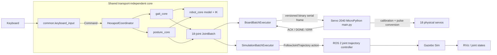

[Project home](../README.md) · [Documentation index](README.md)

# Architecture

ROSBug uses one transport-independent motion core for the physical robot and
simulation. The adapters differ, but both consume the same timed, 18-joint
`JointBatch` objects.

## Repository layout

```text
ROSBug-Hexapod/
├── cad/stl/                         printable mechanical parts
├── common/
│   └── keyboard_input.py            shared nonblocking keyboard mapping
├── gait_core/
│   └── lite_gait.py                 tripod paths, swings, templates, gait state
├── posture_core/
│   └── posture.py                   elevation, pitch, roll, limits, smoothing
├── robot_core/
│   ├── control.py                   commands and normal/auto/posture modes
│   ├── coordinator.py               shared motion arbitration
│   ├── execution.py                 shared batch-executor result contract
│   ├── feedback.py                  structured command/state feedback
│   ├── model.py                     geometry, frames, fixed-foot transforms, IK
│   └── motion_batch.py              transport-neutral JointBatch and goal IDs
├── hardware/                        physical-robot-only code
│   ├── firmware/                    MicroPython runtime and recovery files
│   ├── batch_executor.py            reusable binary serial batch executor
│   ├── board_interface.py           host keyboard frontend
│   ├── main.py                      Servo 2040 calibration and playback
│   ├── protocol.py                  shared host/MicroPython wire protocol
│   └── calibration.txt              readable calibration constants
├── ros2_ws/src/hexapod_sim/         simulation-only ROS 2 package
│   ├── config/                       ros2_control configuration
│   ├── launch/                       Gazebo and RViz launch files
│   ├── meshes/                       simulation meshes
│   ├── rviz/                         RViz configuration
│   ├── scripts/                      simulation adapter and batch executor
│   └── urdf/                         robot model and Gazebo integration
├── docs/                             documentation and media
├── requirements.txt                 host Python dependency (`pyserial`)
├── run_sim_docker.sh                Docker simulation entry point
└── README.md                         project landing page
```

## Communication



The Pi sends timed joint points in batches. The Servo 2040 firmware validates,
calibrates, and plays those points, but intentionally has no knowledge of
whether they came from the gait generator, posture generator, or another
future producer.

| Concern | Hardware | Simulation |
| --- | --- | --- |
| Batch transport | Binary USB serial | `FollowJointTrajectory` action |
| Joint point representation | 18 float32 radians | 18 ROS position values in radians |
| Point timing | Discrete board-clock application; no interpolation | Controller may interpolate between timed points |
| Hardware conversion | Robot radians → calibrated servo degrees → pulses | Not used |
| Completion | Text `ACK` then `DONE`/`ERR` | ROS action result |
