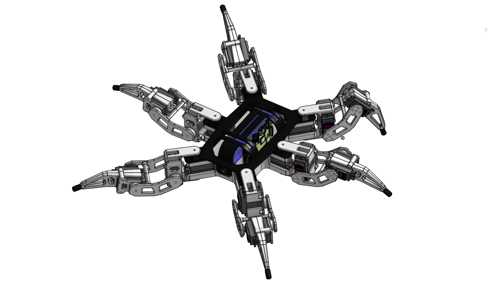
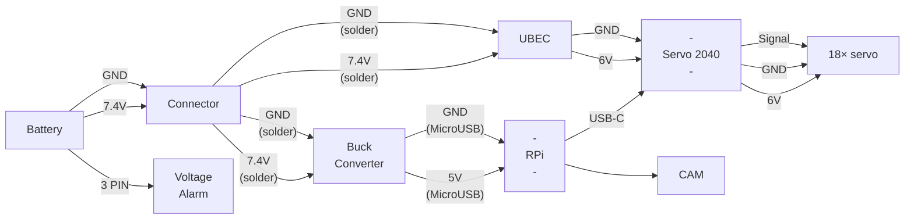

[Project home](../README.md) · [Documentation index](README.md)

# Hardware design

## CAD

The editable mechanical model is available in the
[ROSBug Hexapod Onshape document](https://cad.onshape.com/documents/2a9acbb79b23a0da46d8b498/w/10c7141c859961b97a14543a/e/498922900873c82099a5cf37).
Print-ready meshes are included in [`cad/stl`](../cad/stl).

## Electronics

Parts, printed components, fasteners, and tools are listed in the
[bill of materials](bill-of-materials.md).
